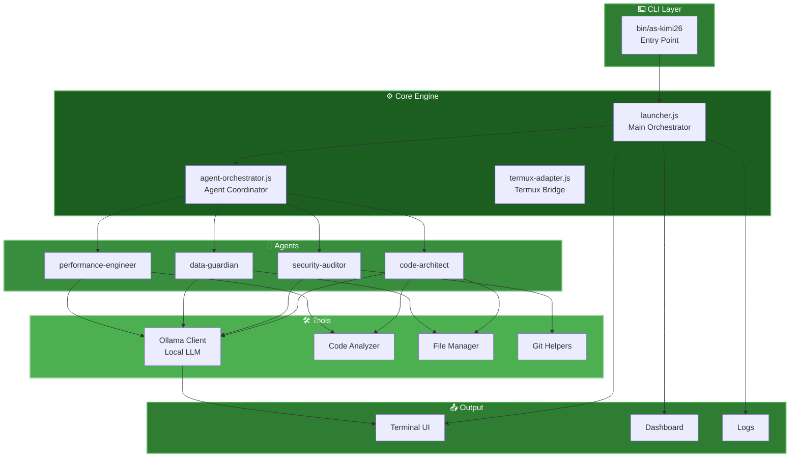

<!---
  as-kimi26 - Kimi 2.6 Multi-Agent Launcher
  Design: Mint Green + Glassmorphism + Google Fonts
-->

<div align="center">
  
# 🌿 as-kimi26

### *Kimi 2.6 Multi-Agent Launcher for Termux*

[](https://termux.com)
[](https://nodejs.org)
[](https://ollama.ai)
[](LICENSE)

> **AI-powered coding assistant** with multi-agent orchestration, built for Termux  
> *Bringing intelligent code assistance to your Android terminal*

</div>

---

## ✨ Features

| Agent | Role | Capabilities |
|-------|------|--------------|
| 🏗️ **Code Architect** | Project structure & code generation | Creates boilerplate, plans architecture |
| 🔒 **Security Auditor** | Vulnerability scanning | Finds security flaws, suggests fixes |
| 🛡️ **Data Guardian** | Data validation & privacy | Ensures data integrity, sanitization |
| ⚡ **Performance Engineer** | Optimization & profiling | Performance analysis, bottleneck detection |

---

## 🧠 System Architecture



---

📁 Project Structure

```
🌿 as-kimi26/
│
├── 📂 bin/
│   └── 🚀 as-kimi26              # CLI launcher (executable)
│
├── 📂 lib/
│   ├── 📂 core/
│   │   ├── launcher.js           # Main launcher engine
│   │   ├── agent-orchestrator.js # Multi-agent orchestration
│   │   ├── termux-adapter.js     # Termux-specific integrations
│   │   └── ollama-client.js      # Ollama API client
│   │
│   ├── 📂 agents/
│   │   ├── code-architect.js     # 🏗️ Project creation
│   │   ├── security-auditor.js   # 🔒 Security scanning
│   │   ├── data-guardian.js      # 🛡️ Data protection
│   │   └── performance-engineer.js# ⚡ Optimization
│   │
│   ├── 📂 tools/
│   │   ├── web-search.js         # 🌏 Web search
│   │   ├── file-manager.js       # 📁 File operations
│   │   ├── git-helpers.js        # 🔀 Git automation
│   │   ├── code-analyzer.js      # 📊 Code analysis
│   │   └── android-tools.js      # 📱 Android utils
│   │
│   ├── 📂 ui/
│   │   ├── terminal-ui.js        # 🖥️ TUI interface
│   │   ├── dashboard.js          # 📈 Live dashboard
│   │   └── colors.js             # 🎨 Color schemes
│   │
│   └── 📂 utils/
│       ├── config.js             # ⚙️ Configuration
│       ├── logger.js             # 📝 Logging system
│       └── helpers.js            # 🔧 Utilities
│
├── 📂 skills/
│   ├── web-development.md        # 🌐 Web dev guide
│   ├── mobile-app.md             # 📱 Mobile apps
│   ├── api-design.md             # 🔌 API design
│   └── termux-setup.md           # 🐧 Termux setup
│
├── 📂 templates/
│   ├── node-project/             # 📦 Node.js template
│   ├── react-app/                # ⚛️ React template
│   ├── python-script/            # 🐍 Python template
│   └── termux-tool/              # 📱 Termux tool
│
├── 📂 docs/
│   ├── README.md
│   ├── INSTALL.md
│   └── API.md
│
├── 📦 package.json
└── ⚙️ .as-kimi26rc               # Default config
```

---

🚀 Quick Start

Installation

```bash
# Clone the repository
git clone https://github.com/your-username/as-kimi26.git
cd as-kimi26

# Install dependencies
npm install

# Run the launcher
node bin/as-kimi26 start
```

Available Commands

```bash
# Start the AI assistant
npm start

# Run a specific agent
node bin/as-kimi26 agent code-architect '{"name":"my-project"}'
node bin/as-kimi26 agent security-auditor '{"target":"./src"}'

# Show help
node bin/as-kimi26 --help
```

---

🎨 Requirements

Requirement Version
Node.js 24.x+
Termux Latest
Ollama 0.1.x+
Storage Permission Required

---

📦 Dependencies

```json
{
  "chalk": "^4.1.2",
  "commander": "^11.1.0",
  "node-fetch": "^2.7.0"
}
```

---

🤝 Contributing

1. Fork the repository
2. Create your feature branch (git checkout -b feature/amazing)
3. Commit your changes (git commit -m 'Add amazing feature')
4. Push to the branch (git push origin feature/amazing)
5. Open a Pull Request

---

📄 License

MIT © as-kimi26

---

<div align="center">

Built with 💚 for Termux
Code. Create. Innovate.

</div>
